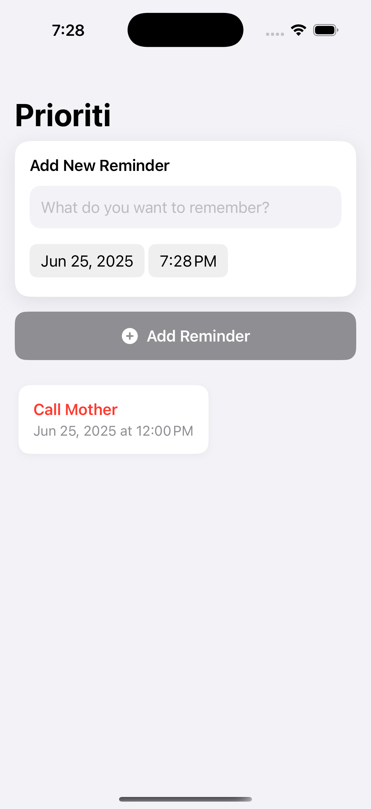

# Prioriti

**Prioriti** is a simple reminder app built with **SwiftUI**.  
This is an ongoing project I’m using to learn Swift and iOS development through hands-on exploration of app architecture, SwiftUI components, state management, and system features like local notifications.

---

## Features

- Add new reminders with title and time
- Swipe to delete reminders
- Local notifications when reminders are due
- Overdue reminders visually highlighted
- Adaptive light/dark mode styling

---

## In Progress

This project is actively evolving as I learn more about:
- SwiftUI best practices
- MVP architecture
- Data persistence with UserDefaults and Core Data
- Unit testing and UI testing
- App Store distribution

---

## Screenshots

## Why I'm Building This

I'm using **Prioriti** as a playground to apply SwiftUI concepts in a real-world context. It's helping me understand the iOS ecosystem while building something functional and meaningful.

---

## Built With

- [Swift](https://swift.org/)
- [SwiftUI](https://developer.apple.com/documentation/swiftui/)
- Xcode

---

## Feedback or Ideas?

Feel free to open an issue or submit a pull request if you have suggestions or want to collaborate!

---
